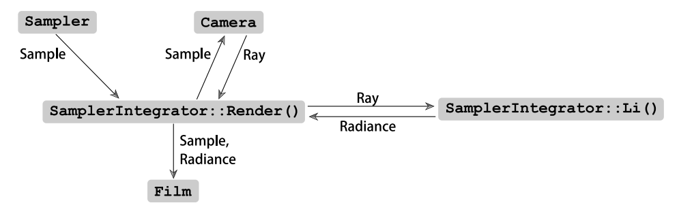
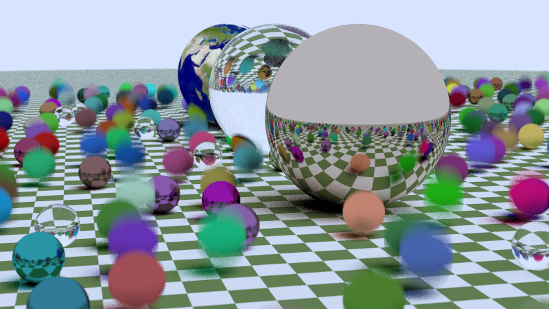
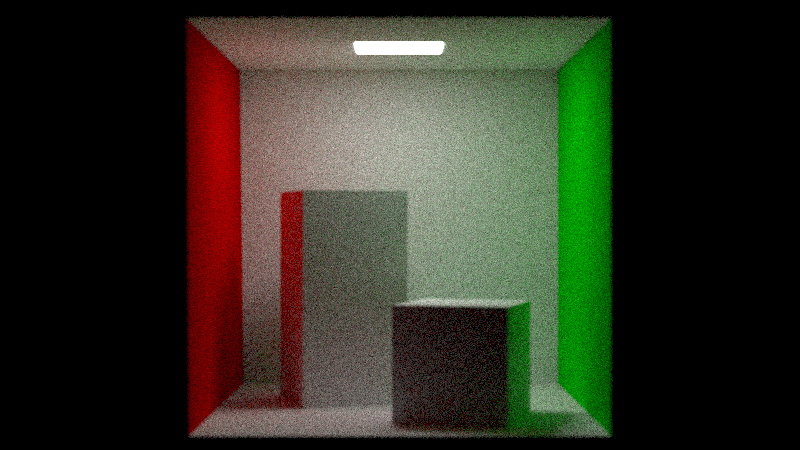
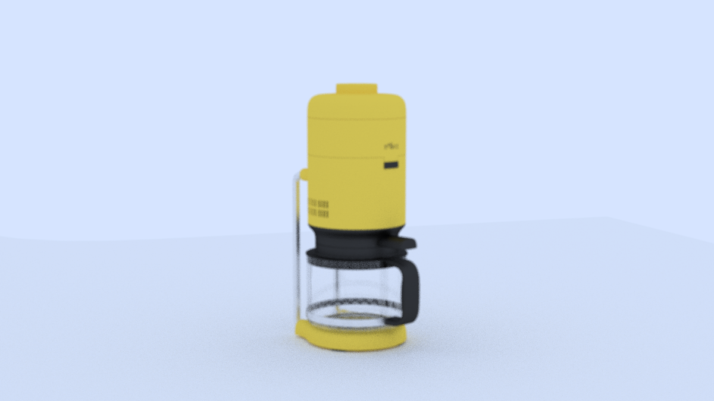

# AsukaRenderer

## 架构 (模仿PBRT-v3编写)

## 效果图

## 多线程渲染示例
<iframe src="//player.bilibili.com/player.html?aid=791739845&bvid=BV1aC4y197TG&cid=1351376244&p=1" scrolling="no" border="0" frameborder="no" framespacing="0" allowfullscreen="true"> </iframe>